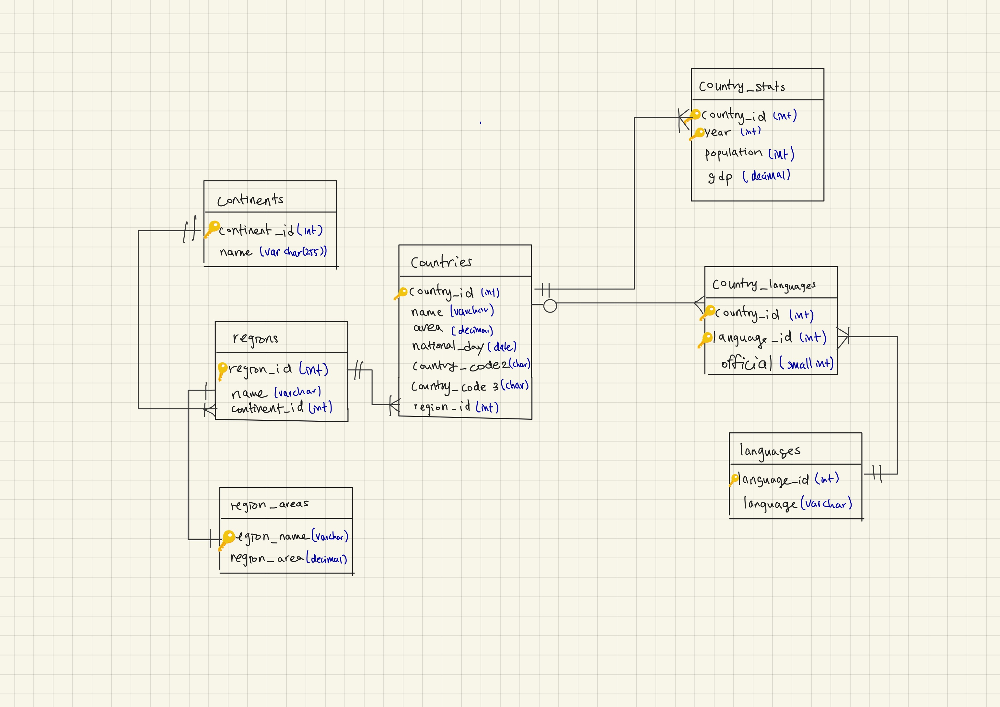
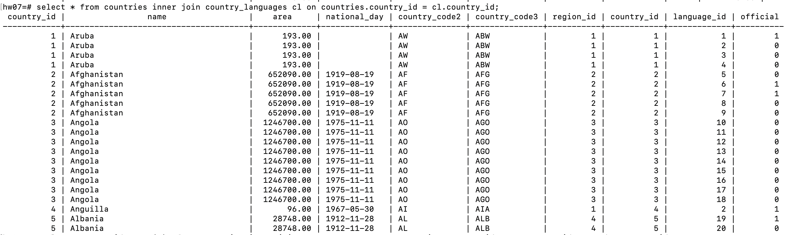
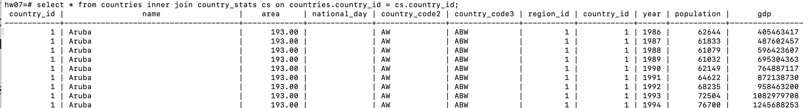
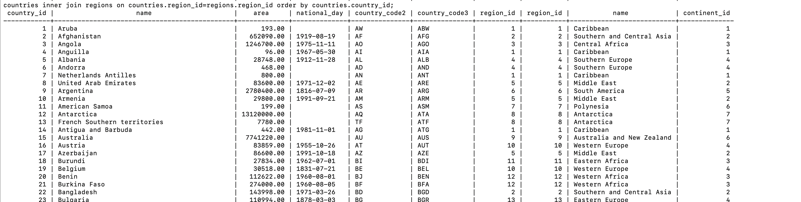
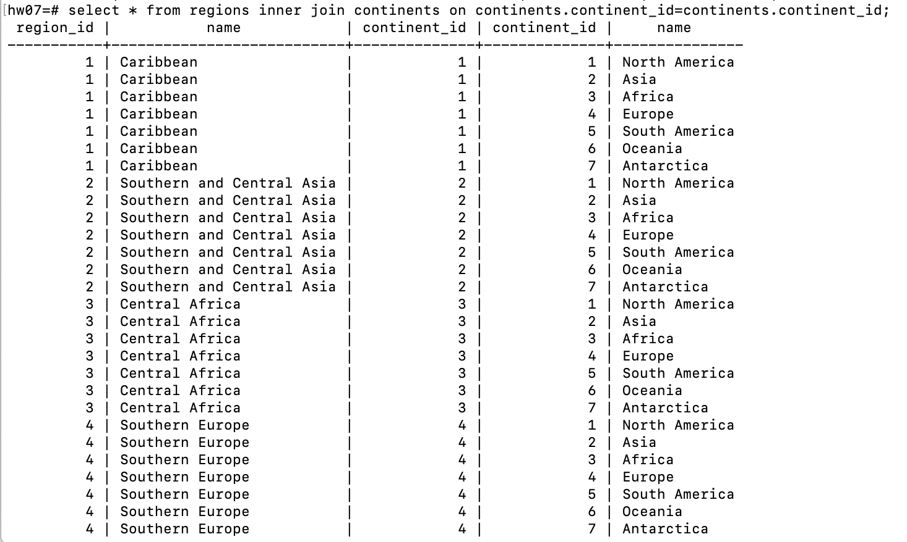
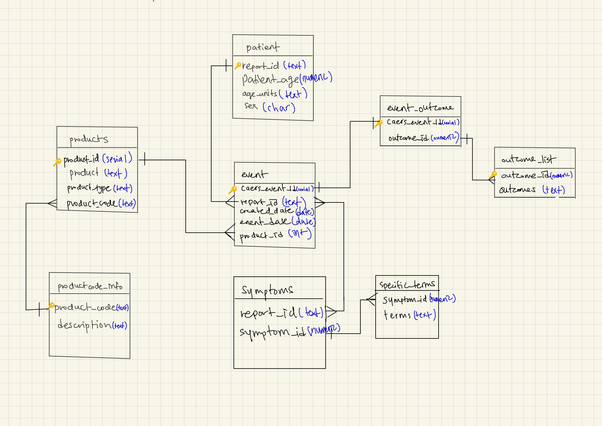

## Part 1: Create an ER Diagram by inspecting tables

### "join" tables required for many-to-many relationships

As above shows, countries can have zero or more languages. So it is zero or more to many relationship. (countries-country_languages)

As above shows, one country could have more than one country_stats, so it is one to many relationship. (countries-country_stats)

As above shows, there are many countries in one region_id. Thus, country - regions is  many to one relationship.

As above shows, there are many contient_id in one region_id. Thus, continents and regions is one to many relationship.

Although I did not add more join tables,, 

name in regions table and region_name in region_areas is one to one relationship. And country_languages and languages is many to one relationship because language_id in country_languages is fk. 

## Part 2: Run Queries
Queries in `part2_queries.sql`
[Link to query codes](src/part2_queries.sql)

## Part 3: Examine a data set and create a normalized data model to store the data

Exloring inside `src/part3_03_explore.sql`
[Link to examine codes](src/part3_03_explore.sql)

As a result, this is the er_diagram

## Part 4: Manually write DDL commands (CREATE TABLE statements) to implement your data model

in `src/part4_ddl.sql`
[Link to DDL commands](src/part4_ddl.sql)

